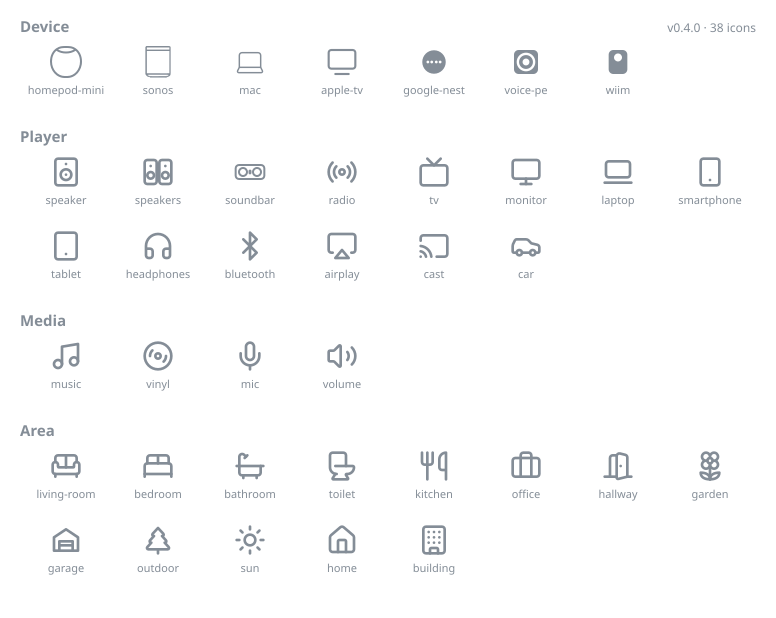

# Music Assistant shared icons

The canonical icon set for Music Assistant players, devices and areas. One set of
identifiers served by the server, one set of SVG artwork rendered by every client
(web frontend, mobile app, and anything else that comes along).

## Why this exists

Player icons used to be free-form [Material Design Icons](https://pictogrammers.com/library/mdi/)
names (`mdi-speaker`), which tied every client to the MDI set and made the web
frontend's icon choices leak into other clients. This repo replaces that with:

- **A small, curated set of set-agnostic icon ids.** The server stores and serves
  `"speaker"` or `"kitchen"`, it knows nothing about icon libraries.
- **One SVG per id** as the canonical artwork every client renders, whether it uses
  the files directly or maps ids to equivalent icon components.
- **A machine-readable [`manifest.json`](manifest.json)** that is nothing but the
  contract: the list of ids and the fallback. Everything presentational lives in
  the non-normative [`meta.json`](meta.json).

## The set

Browse the searchable gallery at **https://music-assistant.github.io/shared-icons/** —
regenerated from the manifest on every push. Individual SVGs can be hotlinked via
jsDelivr, e.g. `https://cdn.jsdelivr.net/gh/music-assistant/shared-icons@main/icons/speaker.svg`.

<!-- GENERATED:START — do not edit by hand; run `node scripts/generate-docs.mjs` -->



| Id             | Name          | Category | Keywords                                            |
| -------------- | ------------- | -------- | --------------------------------------------------- |
| `homepod-mini` | HomePod mini  | device   | apple, smart speaker, siri, homepod                 |
| `sonos`        | Sonos         | device   | speaker, smart speaker                              |
| `mac`          | Mac           | device   | apple, computer, macbook                            |
| `apple-tv`     | Apple TV      | device   | apple, media box, set-top box, appletv              |
| `google-nest`  | Google Nest   | device   | google, nest, smart speaker, google home, assistant |
| `voice-pe`     | Voice PE      | device   | home assistant, voice, assist, preview edition      |
| `wiim`         | WiiM          | device   | streamer, smart speaker, amp                        |
| `speaker`      | Speaker       | player   | audio, hifi                                         |
| `speakers`     | Speaker group | player   | group, pair, stereo, multiple                       |
| `soundbar`     | Soundbar      | player   | bar, tv audio, home theater, home cinema            |
| `radio`        | Radio         | player   | tuner, fm, receiver                                 |
| `tv`           | TV            | player   | television, screen                                  |
| `monitor`      | Monitor       | player   | screen, desktop, display, computer                  |
| `laptop`       | Laptop        | player   | computer, notebook                                  |
| `smartphone`   | Smartphone    | player   | phone, mobile, cellphone, android, iphone           |
| `tablet`       | Tablet        | player   | ipad, mobile                                        |
| `headphones`   | Headphones    | player   | headset, audio                                      |
| `bluetooth`    | Bluetooth     | player   | wireless, speaker                                   |
| `airplay`      | AirPlay       | player   | apple, streaming                                    |
| `cast`         | Cast          | player   | chromecast, google, streaming                       |
| `car`          | Car           | player   | auto, vehicle, garage                               |
| `music`        | Music         | media    | note, song                                          |
| `vinyl`        | Vinyl         | media    | record, disc, turntable, lp                         |
| `mic`          | Microphone    | media    | karaoke, voice, vocal, microphone                   |
| `volume`       | Volume        | media    | loud, sound                                         |
| `living-room`  | Living room   | area     | sofa, couch, lounge                                 |
| `bedroom`      | Bedroom       | area     | bed, sleep                                          |
| `bathroom`     | Bathroom      | area     | bath, tub, shower                                   |
| `toilet`       | Toilet        | area     | wc, restroom, washroom                              |
| `kitchen`      | Kitchen       | area     | cooking, dining, utensils, fork                     |
| `office`       | Office        | area     | work, study, desk, briefcase                        |
| `hallway`      | Hallway       | area     | door, entrance, entry, corridor                     |
| `garden`       | Garden        | area     | flower, plants, yard                                |
| `garage`       | Garage        | area     | car, parking                                        |
| `outdoor`      | Outdoor       | area     | tree, terrace, patio, outside                       |
| `sun`          | Sun           | area     | patio, terrace, bright, weather                     |
| `home`         | Home          | area     | house, whole home                                   |
| `building`     | Building      | area     | apartment, flat, office building                    |

<!-- GENERATED:END -->

## The contract

These rules are what make it safe for clients to bundle the icons:

1. **Ids are stable forever.** An id is never renamed and never removed. If a
   better name is ever wanted, a new id is added and the old one stays valid.
2. **The set only grows — slowly.** Additions require a real, recurring need
   (not one person's device) and design review. Clients ship the whole set, so
   restraint is a feature.
3. **Unknown id → render `speaker`.** The manifest's `fallback` field is the single
   fallback for every client. A client on an older icon set must degrade gracefully
   when the server serves an id it doesn't know yet.
4. **Ids are the whole contract.** Clients never see legacy values: the server
   migrates previously stored icon names (old `mdi-*` values and pre-1.0 picker
   names) to canonical ids in a one-time update, using
   [`migration/legacy-map.json`](migration/legacy-map.json) — a temporary handoff
   file that moves into the server and is deleted once that migration ships.

## Manifest format

The manifest is deliberately minimal — the smaller the shared spec, the fewer
changes clients ever need to care about:

```jsonc
{
  "version": "1.0.0", // semver of the set
  "fallback": "speaker", // rendered for unknown ids
  "icons": ["speaker", "speakers", "tv" /* … */], // canonical, kebab-case, stable forever
}
```

Ids map 1:1 to `icons/<id>.svg`. The full schema lives in
[`schema/manifest.schema.json`](schema/manifest.schema.json) and is enforced in CI
together with the SVG rules below (`node scripts/validate.mjs`).

Display names, gallery categories, picker search terms and artwork provenance
(upstream set/name/version — needed for attribution and re-vendoring) live in
[`meta.json`](meta.json). That file is **not part of the contract**: clients don't
read it, entries can change freely, and clients are free to label, translate,
group and search the icons however fits their UI.

## Artwork rules

- `viewBox="0 0 24 24"` => everything is drawn on the shared 24×24 grid.
- Painted exclusively with `currentColor`; no hardcoded colors, so clients theme
  icons by setting the CSS/text color.
- Stroke icons follow the [Lucide](https://lucide.dev) style: `stroke-width="2"`,
  round caps and joins, `fill="none"`. Fill icons (detailed device silhouettes)
  are the exception, not the rule.
- No scripts, embedded images or external references. Max 6 KB per file.
- Vendored icons are committed as generated — edit custom artwork only; re-vendor
  upstream icons instead of hand-editing them.

> **Note:** the four original custom icons (`apple-tv`, `mac`, `homepod-mini`,
> `sonos`) were authored on larger grids and are currently normalized with a scale
> transform, `speakers` is a first draft, and `soundbar` uses a 1.5 stroke for
> detail. A design pass redrawing them natively on the 24×24 grid (stroke 2 where
> feasible) is welcome.

## Using the icons

This repo is a versioned source of truth, not a runtime dependency: nobody installs
it, every client syncs from tagged releases.

**Web frontend** — vendor a copy of `manifest.json` (refreshed at each tag) to know
the legal ids and the fallback. The picker offers exactly those ids; the frontend
owns its id → component map (custom MA components + `@lucide/vue` components), its
own translated labels, and its own search/grouping. `meta.json` is a handy reference
when building that map, nothing more. Keep the installed Lucide version aligned with
the versions recorded in `meta.json`; when bumping it, re-vendor this repo's SVGs in
the same change so all clients stay visually in sync.

**Mobile (Kotlin Multiplatform)** — at each tag, download `icons/*.svg` and convert
them to vector assets (ids map 1:1 to file names), maintaining an id → asset map.
Render the `fallback` icon for unknown ids.

**Server** — stores and serves icon ids only (player `icon` config entries), with
`speaker` / `speakers` as defaults. A one-time startup migration converts previously
stored legacy names using [`migration/legacy-map.json`](migration/legacy-map.json):
values already canonical are untouched, mapped values are rewritten, unmappable
`mdi-*` values drop to the default, and any other unknown value is left in place
(clients render the fallback for it).

## Adding an icon

1. Open an issue first, see rule 2 above. Agree on the id, category and source.
2. Prefer vendoring from [Lucide](https://lucide.dev) or [Tabler](https://tabler.io/icons);
   only draw custom artwork for things those sets don't have.
3. Add `icons/<id>.svg` following the artwork rules.
4. Add the id to `manifest.json` and its metadata (name, category, source,
   keywords) to `meta.json`.
5. Run `node scripts/validate.mjs && node scripts/generate-docs.mjs` (the second
   command refreshes the README table, `docs/preview.svg` and the gallery — CI
   fails if they're stale) and open a PR.

## Versioning & releases

The set is versioned semantically in `manifest.json`, and a release is simply a git
tag (`v1.0.0`) — clients sync from tags, nothing is published to any registry:

- **patch** — artwork tweaks, keyword additions, metadata fixes
- **minor** — new icons
- **major** — never, if we do our job right (the contract forbids breaking changes)

## License

Apache-2.0 for this repository and the custom icons. Vendored icons remain under
their upstream licenses — see [ATTRIBUTION.md](ATTRIBUTION.md).
